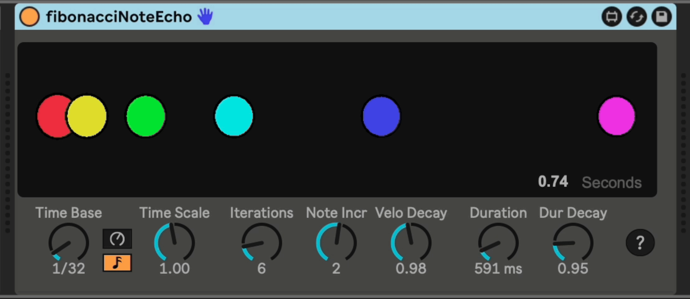

# m4l-js-fibonacciNoteEcho

This Max For Live device uses Javascript to implement a MIDI note echo effect where the echoes follow the pattern of the [Fibonacci Sequence](https://en.wikipedia.org/wiki/Fibonacci_number).

## Break it Down

This device receives MIDI notes, and transmits one or more MIDI notes as a result. When it is sending more than the original note (i.e. "Iterations" set to a value greater than 1) the time delay between the notes uses Fibonacci number multiples of the "Time Base" value. In two dimensions, the Fibonacci sequence can be used to plot spiral shapes that resemble those found in nature. In one-dimensional sound space, the echoes are spaced further and further apart, perhaps in a way that is pleasing to our natural ears and brains.

The controls are on top, with a visualization below, showing relative time between echoes (horizontal position of circles, starting on the left), relative velocity (size of circle), and pitch (indicated by color).



## Installation / Setup

If you just want to download and install the device, then go to the [frozen/](https://github.com/zsteinkamp/m4l-js-fibonacciNoteEcho/tree/main/frozen) directory and download the newest version there.

### Changelog

- [v5](https://github.com/zsteinkamp/m4l-js-fibonacciNoteEcho/releases/download/v5/fibonacciNoteEcho-v5.amxd) - 2024-10-29 - Add non-blocking telemetry ping on load. Does not send any identifying information, only the plugin name, the local computer name, type of computer, and CPU type. I just want to see which plugins are used the most.
- [v4](https://github.com/zsteinkamp/m4l-js-fibonacciNoteEcho/releases/download/v4/fibonacciNoteEcho-v4.amxd) - 2024-07-28 - Rewrite in Typescript; Flash the bubbles!
- [v3](https://github.com/zsteinkamp/m4l-js-fibonacciNoteEcho/raw/main/frozen/FibonacciNoteEcho-v3.amxd) - 2023-07-12 - Added note mode to time base.
- [v2](https://github.com/zsteinkamp/m4l-js-fibonacciNoteEcho/raw/main/frozen/FibonacciNoteEcho-v2.amxd) - 2022-06-13 - Working version.
- v1 - 2022-06-12 - Initial frozen release. (REMOVED DUE TO BUG)

### Controls

- _Time Base_ - The fundamental unit of time to operate on. If you are trying to use this in existing music and you want it to fit rythmically, you can lock it to the song tempo with the note icon and then choose a note division as the time base. Otherwise you can choose the clock icon and set it in milliseconds.

- _Time Scale_ - A quick way to scale the Time Base of the effect, the value of Time Scale will be used in place of starting with "1" in generating the sequence, so you can easily switch to double-time if you set this to 0.5.

- _Iterations_ - The number of notes to emit. Each successive note will be delayed from the last note according to the Fibonacci Sequence.

- _Note Incr_ - Controls how each successive note pitch differs from the last. For example, set to +12 to have each note in the echo sequence increase by an octave.

- _Vel Decay_ - The factor by which the note velocity is multiplied in each iteration. Numbers less than one will result in velocity decreasing with each note echo. Values greater than one will result in increasing velocity values.

- _Duration_ - The plugin is simple in its handling of MIDI note events, and only understands note-on events, so the Duration value controls the length of each note.

- _Dur Decay_ - Similar to Velocity Decay, but for Duration. This value controls how the successive note durations are shortened (values < 1) or lengthened (values > 1).

## Development

The source for the `*.js` files in this repo are the Typescript files located in the `src/` directory.

This repo is set up to use a VSCode devcontainer (or `docker compose`) as the build environment, so that you don't have to manage a Node.js / Typescript toolkit on your dev machine.

### With VSCode

Simply run `code .` in the repo to start VSCode. When prompted, select `Remopen in Container`. Any edits to the files in `src/*.ts` will generate corresponding files in `dist/*.js`.

If you want to run `node` or `yarn` commands, you can press `Cmd-J` to open a shell in the container. Since the repo directory is mounted read/write, any changes that are made will be reflected in the local filesystem, where you can them check them in.

For example, to add the `@types/maxmsp` package, I ran this command in the container's shell:

```
yarn add --dev @types/maxmsp
```

This installed the package in the running container and updated the `package.json` and `yarn.lock` files, which I then checked in.

### With docker compose

If you just want to use `docker compose` just run:

```
docker compose up
```

This will build the base container and bring up the build container with your repo directory mounted read/write in the container. Any changes you make to `src/*.ts` files will be transpiled to `dist/*.js` files.

If you want to run some `node` or `yarn` commands, then you will need to get a shell in the container like this:

```
docker compose exec node bash
```

When done, type `exit` to return from the container.

## TODO

- Use note-off events instead of a Duration dial.
