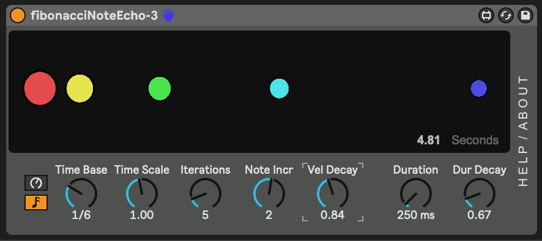

# m4l-js-fibonacciNoteEcho

This Max For Live device uses Javascript to implement a MIDI note echo effect where the echoes follow the pattern of the [Fibonacci Sequence](https://en.wikipedia.org/wiki/Fibonacci_number).

## Break it Down

This device receives MIDI notes, and transmits one or more MIDI notes as a result. When it is sending more than the original note (i.e. "Iterations" set to a value greater than 1) the time delay between the notes uses Fibonacci number multiples of the "Time Base" value. In two dimensions, the Fibonacci sequence can be used to plot spiral shapes that resemble those found in nature. In one-dimensional sound space, the echoes are spaced further and further apart, perhaps in a way that is pleasing to our natural ears and brains.

The controls are on top, with a visualization below, showing relative time between echoes (horizontal position of circles, starting on the left), relative velocity (size of circle), and pitch (indicated by color).

Here is a summary of the plugin controls:

* *Time Base* - The fundamental unit of time to operate on. If you are trying to use this in existing music and you want it to fit rythmically, set it to something close to 1/4, 1/8, or 1/16 note in your song tempo.

* *Iterations* - The number of notes to emit. Each successive note will be delayed from the last note according to the Fibonacci Sequence.

* *Seed* - A quick way to scale the Time Base of the effect, the value of Seed will be used in place of starting with "1" in generating the sequence.

* *Velocity Decay* - The factor by which the note velocity is multiplied in each iteration. Numbers less than one will result in velocity decreasing with each note echo. Values greater than one will result in increasing velocity values.

* *Duration* - The plugin is simple in its handling of MIDI note events, and only understands note-on events, so the Duration value controls the length of each note.

* *Dur Decay* - Similar to Velocity Decay, but for Duration. This value controls how the successive note durations are shortened (values < 1) or lengthened (values > 1).

* *Note Incr* - Controls how each successive note pitch differs from the last. For example, set to +12 to have each note in the echo sequence increase by an octave.

## TODO

* Tempo-sync'd Time Base
* Use note-off events instead of a Duration dial.
